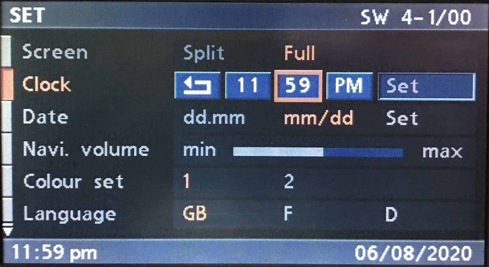
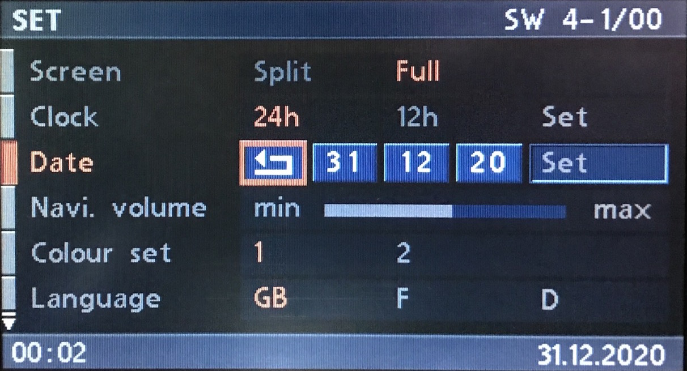
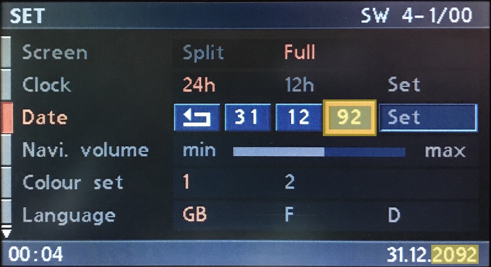
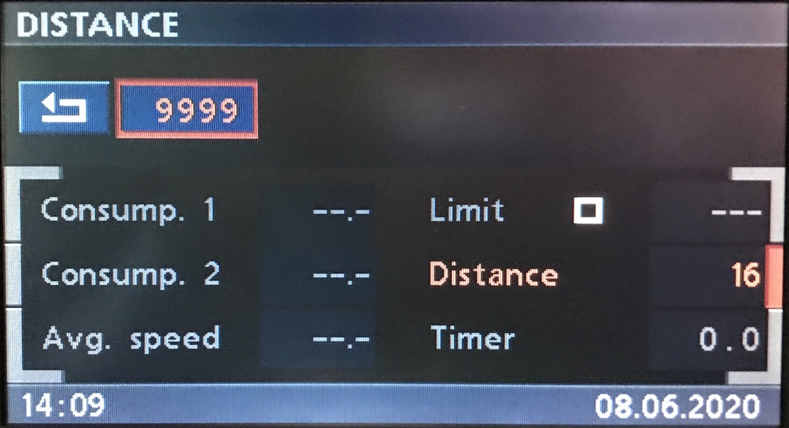
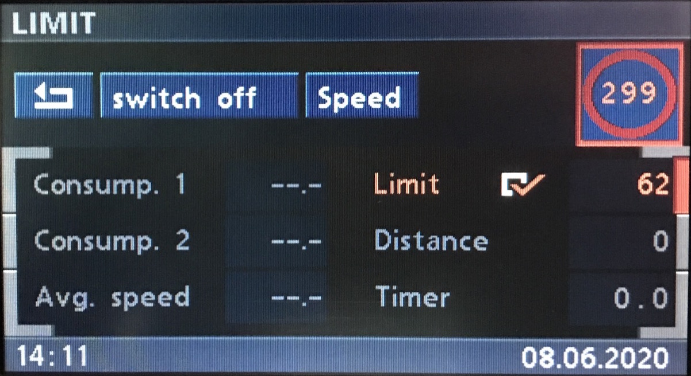
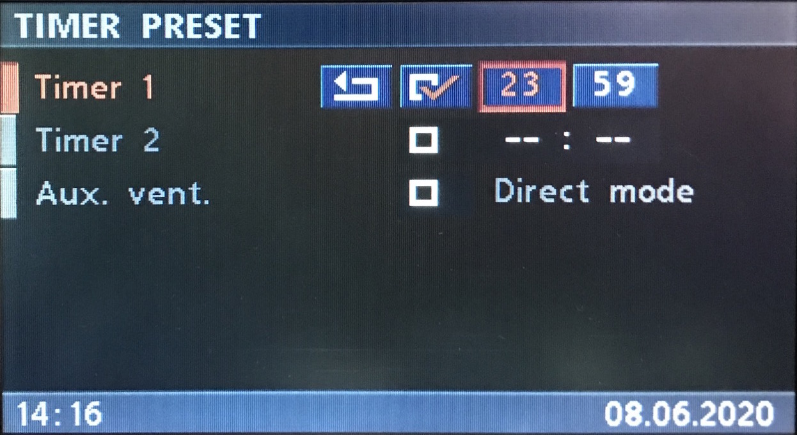
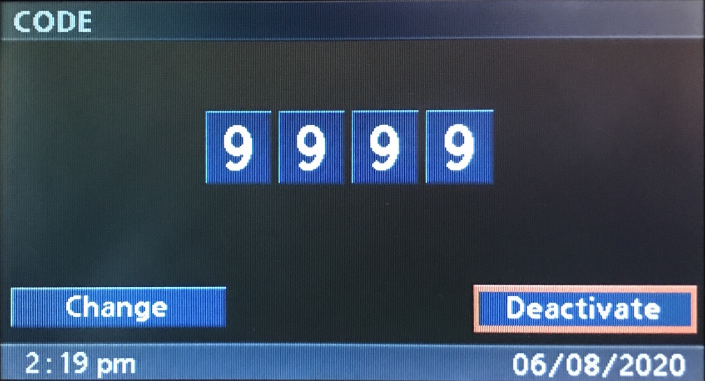

# `0x40` OBC Input

GT `0x3b` → Cluster `0x80`

This is only applicable to vehicles equipped with BMBT. _Whereas the MID requires the cluster to maintain state.. the GT can input full stuff._

### Examples

    3B 07 80 40 01 8A 2B 2D 71
    3B 07 80 40 02 19 03 14 F0
    3B 06 80 40 07 00 00 FA
    3B 06 80 40 09 00 14 E0
    3B 06 80 40 0D 27 0F D8
    3B 06 80 40 0F 8B 00 79
    3B 06 80 40 10 02 36 D9

## Properties

The message length will vary depending on the property ID.

Property|Index|Length|Type
:-------|:----|:-----|:---
**Property [ID]**|`0`|`1`|Bitfield
**Data**|`1`|`-1`|Various

### Property ID

ID|Property
:--|-------
`0x01`|Time
`0x02`|Date
`0x07`|Distance
`0x09`|Limit
`0x0d`|Code
`0x0f`|Aux. Timer 1
`0x10`|Aux. Timer 2

### Data

The length and type will vary depending on the given *Property ID*.

## Use Cases

### Date & Time

#### Time

Data|Index|Length|Type
:---|:----|:-----|:---
**Hour**|`1`|`1`|Integer (8-bit)
**Minute**|`2`|`1`|Integer (8-bit)

The input is in whichever time format the user has set for the vehicle, i.e. 12H or 24H.

_The format must match in order to be parsed correctly?_

##### 12h Format

    
    # AM
    3B 06 80 40 01 0C 00 F0     # 12:00am
    3B 06 80 40 01 0C 3B CB     # 12:59am
    
    3B 06 80 40 01 01 00 FD     # 01:00am
    3B 06 80 40 01 02 00 FE     # 02:00am
    3B 06 80 40 01 03 00 FF     # 03:00am
    # [...]
    3B 06 80 40 01 0A 00 F6     # 10:00am
    3B 06 80 40 01 0B 00 F7     # 11:00am
    # PM
    3B 06 80 40 01 8C 00 70     # 12:00pm
    3B 06 80 40 01 8C 37 47     # 12:55pm
    3B 06 80 40 01 81 00 7D     # 01:00pm
    3B 06 80 40 01 82 00 7E     # 02:00pm
    3B 06 80 40 01 83 00 7F     # 03:00pm
    ...
    3B 06 80 40 01 8B 3B 4C     # 11:59pm

##### 24h Format

    3B 06 80 40 01 00 00 FC     # 00:00
    3B 06 80 40 01 00 3B C7     # 00:59
    3B 06 80 40 01 01 00 FD     # 01:00
    3B 06 80 40 01 02 00 FE     # 02:00
    3B 06 80 40 01 03 00 FF     # 03:00
    # [...]
    3B 06 80 40 01 0A 00 F6     # 10:00
    3B 06 80 40 01 0B 00 F7     # 11:00
    3B 06 80 40 01 0C 00 F0     # 12:00
    
                                # 13:00
                                # 14:00
                                # 15:00
                                # 16:00
    3B 06 80 40 01 11 3B D6     # 17:00
    3B 06 80 40 01 12 3B D5     # 18:00
    3B 06 80 40 01 13 00 EF     # 19:00
    3B 06 80 40 01 14 3A D2     # 20:00
                                # 21:00
    3B 06 80 40 01 16 00 EA     # 22:00
    3B 06 80 40 01 17 00 EB     # 23:00
    3B 06 80 40 01 17 3B D0     # 23:59

#### Date

Data|Index|Length|Type
:---|:----|:-----|:---
**Day**|`1`|`1`|Integer (8-bit)
**Month**|`2`|`1`|Integer (8-bit)
**Year**|`3`|`1`|Integer (8-bit)

Unlike time, the date format does not affect input.

    # Date
    3B 07 80 40 02 01 01 14 EA      # 01/01/2020
                                    # 31/01/2020
                                    # 01/12/2020
                                    # 31/12/2020

##### Year Limitation

The only trick is *Year* for which the input is limited to *YY*, e.g. *15* represents *2015*.

This begs the question, with an input of *25*, is that *1925*, or *2025*?

Fortunately we need not worry about this for many decades as the navigation OS software (`4-1/00`) defaults to years *1993 to 2092*.

Input|Year
:----|:----
`00..92`|`2000..2092`
`93..99`|`1993..1999`

    
    3B 07 80 40 02 1E 0A 61 8B      # 30/10/1997
    3B 07 80 40 02 1F 0C 62 8F      # 31/12/1998
    3B 07 80 40 02 1F 0C 63 8E      # 31/12/1999
    3B 07 80 40 02 01 01 00 FE      # 01/01/2000
    3B 07 80 40 02 01 01 01 FF      # 01/01/2001
    3B 07 80 40 02 01 01 02 FC      # 01/01/2002

---

### On-board Computer (OBC)

#### Distance

Data|Index|Length|Type
:---|:----|:-----|:---
**Distance**|`1`|`2`|Integer (16-bit)

Input is in whichever distance format is in use, i.e. KMS or MLS.

Note: distance is set automatically during active navigation.
    
_TODO!_

    3B 06 80 40 07 04 F0 0E     # Distance: 1264
    3B 06 80 40 07 0D 6E 99     # Distance: 3438

#### Limit

Input unit will reflect distance unit, e.g. KM/H (KMS), or MPH (MLS).

Data|Index|Length|Type
:---|:----|:-----|:---
**Limit**|`1`|`2`|Integer (16-bit)

_TODO!_

    # Limit: 01
    # Limit: 16
    # Limit: 62
    # Limit: 100
    # Limit: 250

---

### Independent Ventilation and Heating

#### Aux Timer 1

Data|Index|Length|Type
:---|:----|:-----|:---
**Hour**|`1`|`1`|Integer (8-bit)
**Minute**|`2`|`1`|Integer (8-bit)

Like *Time*, input format is based on user configuration.

##### 12h Format

_TODO!_
    
    3B 06 80 40 0F 81 00 73     # 01:00pm
    3B 06 80 40 0F 8B 00 79     # 11:00pm

##### 24h Format

_TODO!_

    ...

#### Aux Timer 2

See above!

---

### Code

Data|Index|Length|Type
:---|:----|:-----|:---
**Code**|`1`|`2`|Integer (16-bit)
    
    3B 06 80 40 0D 00 00 F0     # Code: 0000
    3B 06 80 40 0D 00 7B 8B     # Code: 0123 (0x7b)
    3b .. 80 40 0d 00 ff ..     # Code: 0255 (0xff)
    # Code: 1000 (0x3e8)
    # Code: 1024 (0x400)
    # Code: 2048 (0x800)
    # Code: 4096 (0x1000)
    3B 06 80 40 0D 27 00 D7     # Code: 9984 (0x2700)
    3B 06 80 40 0D 27 0F D8     # Code: 9999 (0x270f)