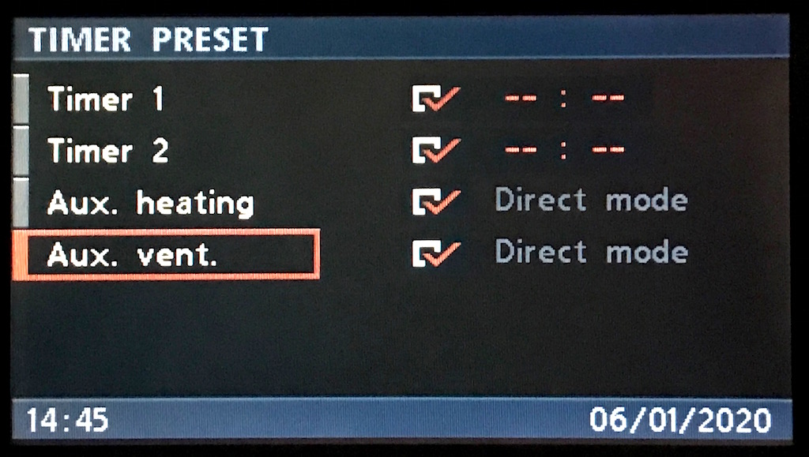

# `0x41` OBC Control

GT `0x3b` → Cluster `0x80`

This is applicable to the BMBT only.

## Examples

    3B 05 80 41 03 01 FD
    3B 05 80 41 07 01 F9
    3B 05 80 41 09 03 F5
    3B 05 80 41 0D 02 F0
    3B 05 80 41 0F 01 F1
    3B 05 80 41 0F 02 F2
    3B 04 80 41 11 EF
    3B 04 80 41 13 ED
    3B 05 80 41 1B 02 E6
    3B 05 80 41 1B 03 E7

## Properties

Fixed length*. Two byte bitfield.

Property|Index|Length|Type
:-------|:----|:-----|:---
**Property [ID]**|`0`|`1`|Bitfield
**Control**|`1`|`1`|Bitfield

*\* with one exception discussed in [Use Cases]().*

### Property ID

    TIME              = 0x01
    DATE              = 0x02
    TEMPERATURE       = 0x03
    CONSUMP_1         = 0x04
    CONSUMP_2         = 0x05
    RANGE             = 0x06
    DISTANCE          = 0x07
    ARRIVAL           = 0x08
    LIMIT             = 0x09
    AVG_SPEED         = 0x0a
    MEMO              = 0x0c
    CODE              = 0x0d
    TIMER             = 0x0e
    AUX_TIMER_1       = 0x0f
    AUX_TIMER_2       = 0x10
    AUX_HEAT_OFF      = 0x11
    AUX_HEAT_ON       = 0x12
    AUX_VENT_OFF      = 0x13
    AUX_VENT_ON       = 0x14
    TIMER_LAP         = 0x1a
    AUX_STATUS        = 0x1b
    
### Control

    REQUEST_TEXT            = 0b0000_0001   # 0x01
    REQUEST_STATUS          = 0b0000_0010   # 0x02
    ACTIVATE                = 0b0000_0100   # 0x04
    DEACTIVATE              = 0b0000_1000   # 0x08
    RECALCULATE             = 0b0001_0000   # 0x10
    SET_AS_CURRENT_SPEED    = 0b0010_0000   # 0x20
    
#### Request Text `0b0000_0001`

A request for a given property to be populated. The cluster will reply with `0x24`.

This is used by GT at ignition to initilise various properties, or if the GT cache has expired, requiring a property be updated.

    3B 05 80 41 01 01 FF    # Time:         Request Text
    3B 05 80 41 02 01 FC    # Date:         Request Text
    
    3B 05 80 41 03 01 FD    # Temp.:        Request Text
    3B 05 80 41 04 01 FA    # Consump. 1:   Request Text
    3B 05 80 41 05 01 FB    # Consump. 2:   Request Text
    3B 05 80 41 06 01 F8    # Range:        Request Text
    3B 05 80 41 07 01 F9    # Distance:     Request Text
    3B 05 80 41 09 01 F7    # Limit:        Request Text
    3B 05 80 41 0A 01 F4    # Avg. Speed:   Request Text
    3B 05 80 41 0E 01 F0    # Timer:        Request Text
    3B 05 80 41 1A 01 E4    # Timer (Lap):  Request Text
    
    3B 05 80 41 0F 01 F1    # Aux. Timer 1: Request Text
    3B 05 80 41 10 01 EE    # Aux. Timer 2: Request Text

#### Request Status `0b0000_0010`

A request for the status of a given property. The cluster will reply with `0x2a`.

Note: *Aux. Status* `0x1b` represents both aux. heat, and ventilation.
    
    3B 05 80 41 0C 02 F1    # Memo:         Request Status

    3B 05 80 41 09 02 F4    # Limit:        Request Status
    3B 05 80 41 0E 02 F3    # Timer:        Request Status

    3B 05 80 41 0F 02 F2    # Aux. Timer 1: Request Status
    3B 05 80 41 10 02 ED    # Aux. Timer 2: Request Status
    3B 05 80 41 1B 02 E6    # Aux. Status:  Request Status
    
    3B 05 80 41 0D 02 F0    # Code:         Request Status

#### Activate `0b0000_0100`

The nuances of verbiage aside, basically "activate" the given property. 

Note: direct operation of aux. heating, or ventilation is not controlled in this manner. See [Use Cases](#usecases).

    3B 05 80 41 0C 04 F7    # Memo: On
    
    3B 05 80 41 09 04 F2    # Speed Limit: On
    3B 05 80 41 0E 04 F5    # Timer: Start
    
    3B 05 80 41 0F 04 F4    # Aux. Timer 1: On
    3B 05 80 41 10 04 EB    # Aux. Timer 2: On

#### Deactivate `0b0000_1000`

This (surprisingly!) is the inverse of *Activate*.

    3B 05 80 41 0C 08 FB  # Memo: Off
    
    3B 05 80 41 09 08 FE  # Speed Limit: Off
    3B 05 80 41 0E 08 F9  # Timer: Stop
    
    3B 05 80 41 0F 08 F8  # Aux. Timer 1: Off
    3B 05 80 41 10 08 E7  # Aux. Timer 2: Off

#### Recalculate `0b0001_0000`

Recalculate the given property.

    3B 05 80 41 04 10 EB    # Consump. 1: Recalculate
    3B 05 80 41 05 10 EA    # Consump. 2: Recalculate
    3B 05 80 41 0A 10 E5    # Avg. Speed: Recalculate

#### Set As Current Speed `0b0010_0000`

This seems to have a single use, thus the specificity.

    3B 05 80 41 09 20 D6    # Speed Limit: Set As Current Speed
    
## Use Cases

### Independent Ventilation and Heating

Direct operation of aux. heating, and ventilation deviates from standard usage.

There is a dedicated property ID to *activate*, and *deactivate*.
    
    # Dedicated property IDs
    AUX_HEAT_OFF      = 0x11
    AUX_HEAT_ON       = 0x12
    AUX_VENT_OFF      = 0x13
    AUX_VENT_ON       = 0x14

This negates the second bitfield which is omitted, thus reducing the message length by 1 byte.

### Aux. Heating: Direct Mode

    
    3B 04 80 41 11 EF   # Aux. Heat Direct Mode: Off
    3B 04 80 41 12 EC   # Aux. Heat Direct Mode: On
    
### Aux. Vent: Direct Mode

    3B 04 80 41 13 ED   # Aux. Vent. Direct Mode: Off
    3B 04 80 41 14 EA   # Aux. Vent. Direct Mode: On
    
