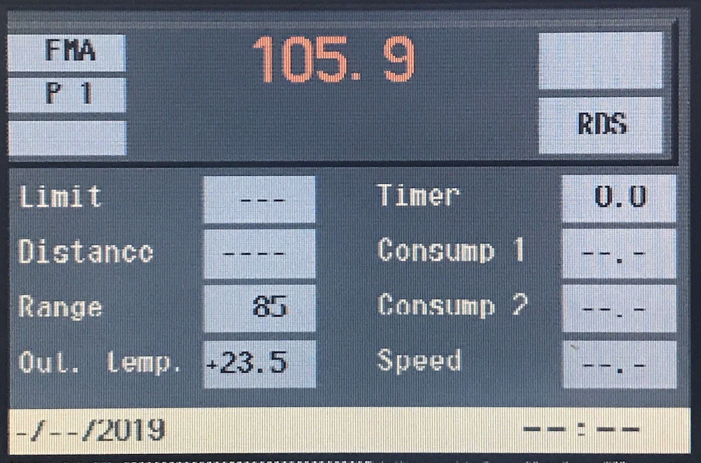
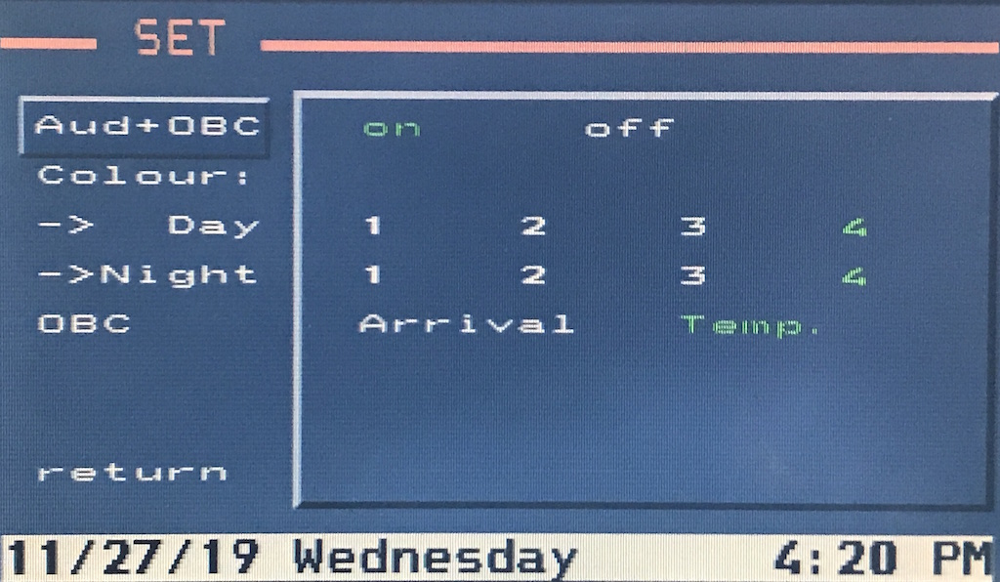

# `0x45` Set Radio UI

GT `0x3b` → Radio `0x68`

Controls radio UI state.

Used in conjunction with `0x46`.

## Examples

    3B 04 68 45 00 12
    3B 04 68 45 02 10
    3B 04 68 45 03 11 

## Parameters

Single byte bitfield.
    
    SHOW_RDIO           = 0b0000_0000
    HIDE_RADIO          = 0b0000_0001
    FLAG_AUDIO_OBC      = 0b0000_0010
    
    # Only applicable to MK3 (3-1/40+), MK4
    FLAG_NEW_UI         = 0b0001_0000
    FLAG_NEW_UI_HIDE    = 0b1000_0000
    
### "Foreground" `0b0000_0000`

Radio to foreground.

This can be sent even if the radio is off, in which case it is ignored by the radio.

### "Background" `0b0000_0001`

Radio to background.

The radio will still draw to display on user input i.e. changing radio station, but will return itself to background after approx. 8 seconds.

### Audio+OBC `0b0000_0010`

See Audio OBC

Only applicable to older UI.

Limit/restrict radio drawing menus to allow Audio OBC to remain in foreground.

### New UI `0b0001_0000`

Flag to signify the new UI that was introduced in ~2001 (`3-1/40`) . 

> The "radio" splitscreen function is only possible with NG *[next generation]* radios (BM53 and BM54 from 03.01).
> *-- BMW Service Training*

The inference is that if an NG radio is required to support splitscreen, the new UI is not backwards compatible with legacy radios (C23 BM etc).

A flag that allows the old and new UIs to be differentiated suggests that the NG radios may retain support for the older UI.

### New UI (On Hide) `0b1000_0000`

Introduced with *New UI* flag.

## Use Cases

### Resume at KL-R

The GT requesting the radio draw the radio UI at KL-R if the radio was on at ignition off

    3B 04 68 45 01 13

### Main Menu

A MENU press does not get sent to radio, but is broadcast, and instead handled by the GT, which will in turn, message the Radio relinquish (as presumably the radio does not listen for global button )

    gt  rad 45 91 (1001 0001) Info? [ON] Main Menu [ON]
    rad gt  46 01 (0000 0001) Main Menu [ON]

### Audio OBC (Legacy UI)

The Audio and Onboard Computer (OBC) display "Audio+OBC" is a feature of the original UI, and allowed OBC data to be displayed alongside radio information.

While this feature was removed from the updated UI (MK3 3-1/40+, MK4), all radio variants, including next generation (NG) radios will support it.

Note: this is really only relevant to BM24, BM54 as there is no contention in the absence of menus.

_Audio+OBC: The MK1 GT, and BM53 with the Audio+OBC feature enabled._
<!---->
<!--_Audio+OBC: A video module GT, and BM53 with the Audio+OBC feature enabled._-->

The bit is set/unset when "Audio+OBC" is enabled/disabled via the "Set" menu. It prevents (_or possibly makes menus a timeout?_) the radio from rendering any menus, thus the OBC remains in the foreground.

_Audio+OBC: Audio+OBC settings..._
<!---->
<!--_Audio+OBC: Audio+OBC settings..._-->

### Updated UI

- Presumably due to split screen which had different fields.
- There's no way of determining if split is enabled, well, short of coding?