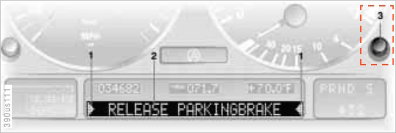

# `0x57` Cluster Buttons

Cluster `0x80` → Broadcast `0xff`

### Related Commands

- `0x3b` [MFL Buttons](../mfl/3b.md)
- `0x48` [BMBT Buttons](../bmbt/48.md)

### Example Frames

    80 04 FF 57 01 2D
    80 04 FF 57 41 6D
    80 04 FF 57 02 2E

## Parameters

Fixed length. 1-byte bitfield.

    STATE   = 0b0100_0000
    BUTTON  = 0b0000_0011

### State `0b0100_0000`

Unlike other buttons, there is no hold event.

    STATE_PRESS     = 0b0
    STATE_RELEASE   = 0b1

### Button `0b0000_0011`

    BUTTON_CHECK    = 0b01  # CHECK button on high clusters
    BUTTON_BC       = 0b10  # BC button on stalk

I'm only aware of the two buttons based on my testing.

## Use Cases

### Check Control

This is only applicable to vehicles equipped with the high cluster (IKE/IKI).

The CHECK button is used to review/clear check control messages on the cluster alphanumeric display.

    80 04 FF 57 01 2D   # CHECK button press
    80 04 FF 57 41 6D   # CHECK button release

### OBC Remote Control

> [...] you can call up information from the on-board computer using the button in the turn signal lever. By pressing the button briefly in the direction of the steering column, you can call up a new function for display.

    80 04 FF 57 02 2E   # BC remote press