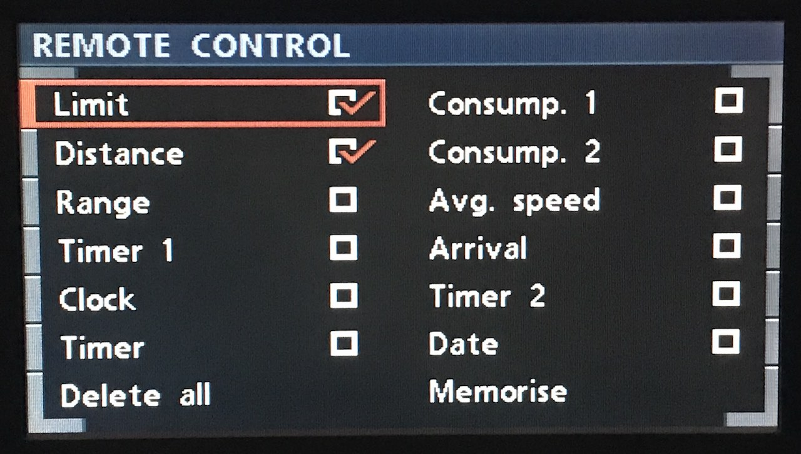

# `0x42` Remote Control

This command is used to configure which of the 12 available functions are recalled on the high (IKE) cluster character display.

No. | Function          | Display
:---|-------------------|---------------------
1.  | Clock             | `"TIME 2:40PM"`
2.  | Date              | `"DATE 12/02/2020"`
3.  | Consump. 1        | `"CONS1 10.1 L/100"`
4.  | Consump. 2        | `"CONS2 13.2 L/100"`
5.  | Range             | `"RANGE 22 KM"`
6.  | Distance          | `"DIST 17 KM"`
7.  | Arrival           | `"ARRIVAL 3:22PM"`
8.  | Limit             | `"LIMIT 60 KM/H"`
9.  | Avg. Speed        | `"SPEED 59.9 KM/H"`
10. | Timer (Stopwatch) | `"STOPW 2:02 MIN"`
11. | Auxiliary Timer 1 | `"*TIMER1 11:03 PM"`
12. | Auxiliary Timer 2 | `" TIMER2  2:54 AM"`

It has two uses which work in sequence:

1. edit the configuration via the GT/BMBT
2. save the configuration to the IKE

### Properties

The message length is fixed, irrespective of the number of enabled functions. Any redundant trailing bytes have a known void value of `0xff`.

Property|Index|Length|Type
:---|:---|:---|:---
**Function**|`0`|`1`|Bit field
**Function**|`1`|`1`|Bit field
**Function**|`2`|`1`|Bit field
**Function**|`3`|`1`|Bit field
**Function**|`4`|`1`|Bit field
**Function**|`5`|`1`|Bit field
**Function**|`6`|`1`|Bit field
**Function**|`7`|`1`|Bit field
**Function**|`8`|`1`|Bit field
**Function**|`9`|`1`|Bit field
**Function**|`10`|`1`|Bit field
**Function**|`11`|`1`|Bit field

#### Examples

    # Example 1 
    # 12 functions (0 unused)
    3B 0F 80 42 01 02 04 05 06 07 08 09 0A 0E 0F 10 EF

Property|F.|F.|F.|F.|F.|F.|F.|F.|F.|F.|F.|F.
---|---|---|---|---|---|---|---|---|---|---|---|---
**Data**|`01`|`02`|`04`|`05`|`06`|`07`|`08`|`09`|`0A`|`0E`|`0F`|`10`

    # Example 2
    # 3 functions (9 unused)
    80 0F 3B 42 10 02 06 FF FF FF FF FF FF FF FF FF 1D

Property|F.|F.|F.|F.|F.|F.|F.|F.|F.|F.|F.|F.
---|---|---|---|---|---|---|---|---|---|---|---|---
**Data**|`10`|`02`|`06`|`FF`|`FF`|`FF`|`FF`|`FF`|`FF`|`FF`|`FF`|`FF`

## Function

1 byte. Combination bit field.
    
    # Function bitmasks
    TIME          = 0b0000_0001   # 0x01
    DATE          = 0b0000_0010   # 0x02
    CONSUMP_1     = 0b0000_0100   # 0x04
    CONSUMP_2     = 0b0000_0101   # 0x05
    RANGE         = 0b0000_0110   # 0x06
    DISTANCE      = 0b0000_0111   # 0x07
    ARRIVAL       = 0b0000_1000   # 0x08
    LIMIT         = 0b0000_1001   # 0x09
    AVG_SPEED     = 0b0000_1010   # 0x0a
    TIMER         = 0b0000_1110   # 0x0e
    AUX_TIMER_1   = 0b0000_1111   # 0x0f
    AUX_TIMER_2   = 0b0001_0000   # 0x10
    
    VOID          = 0b1111_1111   # 0xff

## 1. Edit Configuration

IKE will send the current configuration to GT, which in turn will load the "Remote Control" screen with applicable functions preselected.

Note: the options *Delete all* and *Memorise* are handled by the GT, so neither will return `0x31` like radio or telephone menus. 

#### Example

    # Load "Remote Control" configuration (Distance, Limit)
    80 0F 3B 42 07 09 FF FF FF FF FF FF FF FF FF FF F8

Property|Func.|Func.|F.|F.|F.|F.|F.|F.|F.|F.|F.|F.
---|---|---|---|---|---|---|---|---|---|---|---|---
**Data**|`07`|`09`|`FF`|`FF`|`FF`|`FF`|`FF`|`FF`|`FF`|`FF`|`FF`|`FF`
**Function**|`Distance`|`Limit`|`--`|`--`|`--`|`--`|`--`|`--`|`--`|`--`|`--`|`--`

## 2. Save Configuration

GT will send the selected functions to IKE, at which point the configuration is updated. 

The order of the functions will reflect the sequence in which they were selected. This will also be the order in which they are recalled for display.

#### Example

    # Memorise "Remote Control" selected functions
    3B 0F 80 42 10 02 06 FF FF FF FF FF FF FF FF FF 1D

Property|Func.|Func.|F.|F.|F.|F.|F.|F.|F.|F.|F.|F.
---|---|---|---|---|---|---|---|---|---|---|---|---
**Data**|`10`|`02`|`06`|`FF`|`FF`|`FF`|`FF`|`FF`|`FF`|`FF`|`FF`|`FF`
**Function**|`[Aux.] Timer 2`|`Date`|`Range`|`--`|`--`|`--`|`--`|`--`|`--`|`--`|`--`|`--`