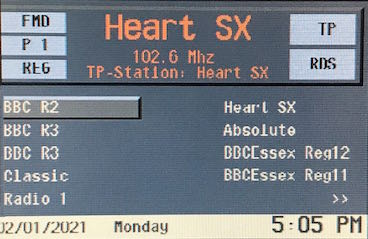
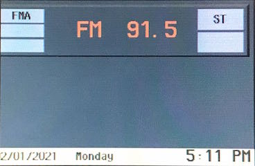

# `0x23` Title Text: Radio

Radio `0x68` → GT `0x3b`  
~~Radio `0x68` → MID `0xc0`~~  
Radio `0x68` → IKE `0x80`  
Radio `0x68` → Broadcast `0xff`

*Only BMBT (GT) usage is discussed!*

### Related

- `0x21` Menu Text: Radio
- `0x24` Property Text: Radio
- `0xa5` Body Text: Radio

### Example Frames

    68 0C 3B 23 C4 20 43 44 20 31 2D 30 31 A2
    
    68 13 FF 23 C4 20 07 20 20 20 20 20 08 43 44 20 31 2D 30 31 56
    
    68 16 80 23 40 20 07 20 2D 35 2D 20 08 46 4D 20 03 31 30 35 2E 31 04 80
    68 19 80 23 50 30 07 20 2D 33 2D 20 08 46 4D 20 03 31 30 30 2E 33 04 20 53 54 A9 
    68 13 80 23 C4 20 07 20 20 20 20 20 08 43 44 20 31 2D 31 33 2A

<!--          "CD 1-01" -->
<!-- # "☐     ☐CD 1-01" -->

## Parameters

Length will vary with *String*.

Property|Index|Length|Type
:-------|:----|:-----|:---
Layout  |`0`  |`1`   |Bitfield
Options |`1`  |`1`   |Bitfield
String  |`2`  |`-1`  |String

---

### Layout

    SOURCE  = 0b1110_0000
    CONFIG  = 0b0001_1111

#### Source `0b1110_0000`

    SOURCE_SERVICE    = 0b000 << 5  # 0x00
    SOURCE_WEATHER    = 0b001 << 5  # 0x20
    SOURCE_ANALOGUE   = 0b010 << 5  # 0x40
    SOURCE_DIGITAL    = 0b011 << 5  # 0x60
    SOURCE_TAPE       = 0b100 << 5  # 0x80
    SOURCE_TRAFFIC    = 0b101 << 5  # 0xa0
    SOURCE_CDC        = 0b110 << 5  # 0xc0

#### Config. `0b0001_1111`

Source specific options.

    # Source: Service Mode (0b000 << 5)
    CONFIG_SERVICE_SERIAL_NUMBER        = 0b0_0010
    CONFIG_SERVICE_SOFTWARE_VERSION     = 0b0_0011
    CONFIG_SERVICE_GAL                  = 0b0_0100
    CONFIG_SERVICE_FQ                   = 0b0_0101
    CONFIG_SERVICE_DSP                  = 0b0_0110
    CONFIG_SERVICE_SEEK_LEVEL           = 0b0_0111
    CONFIG_SERVICE_TP_VOLUME            = 0b0_1000
    CONFIG_SERVICE_AF                   = 0b0_1001
    CONFIG_SERVICE_REGION               = 0b0_1010
    
    # Source: Weather Band (0b001 << 5)
    CONFIG_WEATHER_NONE                 = 0b0_0000
    CONFIG_WEATHER_CH_1                 = 0b0_0001
    CONFIG_WEATHER_CH_2                 = 0b0_0010
    CONFIG_WEATHER_CH_3                 = 0b0_0011
    CONFIG_WEATHER_CH_4                 = 0b0_0100
    CONFIG_WEATHER_CH_5                 = 0b0_0101
    CONFIG_WEATHER_CH_6                 = 0b0_0110
    CONFIG_WEATHER_CH_7                 = 0b0_0111

    # Source: Analogue (i.e. FMA) (0b010 << 5)    
    CONFIG_ANALOGUE_UPDATE              = 0b0_0000
    CONFIG_ANALOGUE_MODE_MANUAL         = 0b0_0001  # [m]
    CONFIG_ANALOGUE_MODE_SCAN           = 0b0_0010  # [SCA]
    CONFIG_ANALOGUE_MODE_SENSITIVE      = 0b0_0011  # [II]
    CONFIG_ANALOGUE_MODE_NON_SENSITIVE  = 0b0_0100  # [I]
    CONFIG_ANALOGUE_TRAFFIC             = 0b0_0110  # < 3/1-30
    CONFIG_ANALOGUE_TRAFFIC_PROGRAM     = 0b0_0111  # < 3/1-30

    CONFIG_ANALOGUE_TRAFFIC_OFF         = 0b0_0000
    CONFIG_ANALOGUE_TRAFFIC_ON          = 0b0_1000  # [T]
    
    CONFIG_ANALOGUE_ST                  = 0b1_0000  # < 3/1-30

    # Source: Digital (i.e. FMD) (0b011 << 5)
    CONFIG_DIGITAL_MENU                 = 0b0_0000  # Stations, Info.
    CONFIG_DIGITAL_RDS                  = 0b0_0001
    CONFIG_DIGITAL_HEADER               = 0b0_0010
    CONFIG_DIGITAL_MP3                  = 0b0_0011

    # Source: Tape (0b100 << 5)
    CONFIG_TAPE_ERROR                   = 0b0_0000  # "TAPE ERROR"
    CONFIG_TAPE_PRES                    = 0b0_0010
    CONFIG_TAPE_FFW                     = 0b0_0011
    CONFIG_TAPE_FW                      = 0b0_0110
    CONFIG_TAPE_RRW                     = 0b0_0100
    CONFIG_TAPE_RW                      = 0b0_0111
    CONFIG_TAPE_CLEAN                   = 0b0_1000
    CONFIG_TAPE_INVERSE                 = 0b0_1001

    CONFIG_TAPE_SIDE_A                  = 0b0_0000
    CONFIG_TAPE_SIDE_B                  = 0b1_0000
    
    # Source: Traffic (0b101 << 5)
    CONFIG_TRAFFIC_NO_STATION           = 0b0_0000
    CONFIG_TRAFFIC_1                    = 0b0_0001
    CONFIG_TRAFFIC_2                    = 0b0_0010
    
    # Source: CDC (0b110 << 5)
    CONFIG_CDC_ERROR                    = 0b0_0000  # "CD ERROR"
    CONFIG_CDC_NO_MAG                   = 0b0_0001  # "NO MAGAZINE"
    CONFIG_CDC_NO_DISC                  = 0b0_0010  # "NO DISC"
    CONFIG_CDC_CHECK                    = 0b0_0011  # "CD CHECK"
    
    CONFIG_CDC_FF                       = 0b0_0101  # [>>]
    CONFIG_CDC_RW                       = 0b0_0110  # [<<R]
    
    CONFIG_CDC_SEARCH                   = 0b0_0100  # [< >] Default
    CONFIG_CDC_SCAN                     = 0b0_0111  # [SCAN]
    CONFIG_CDC_RAND                     = 0b0_1000  # [RND]
    CONFIG_CDC_FF_RW                    = 0b0_1010  # [<< >>]
    
    CONFIG_CDC_LOADING                  = 0b0_1011  # I think...?

---

### Options

These options are to control (and therefore are only applicable to) the high cluster character display. (While this documentation only covers BMBT usage, I suspect they would apply to MID.)
    
    UPDATE  = 0x20
    SET     = 0x30

---

### String

Code Point|Name                      |Description
:---------|:-------------------------|:----------
`0x00`    |NUL                       |Null-terminated string
`0x01`    |Flash Lower Boundary      |Open flashing text encapsulation
`0x02`    |Flash Upper Boundary      |Close flashing text encapsulation
`0x03`    |Property Lower Boundary   |Open encapsulation
`0x04`    |Property Upper Boundary   |Close encapsulation
`0x06`    |LF                        |Line Feed
`0x07`    |Discard Lower Boundary    |Open encapsulation
`0x08`    |Discard Upper Boundary    |Close encapsulation

#### Property Substring

`0x03` and `0x04` define the boundaries for the substring which is written to by the command `0x24`.

For example, here the radio is writing to both GT `0x3b` and IKE `0x80` via the broadcast address `0xff`.
    
    68 19 FF 23 40 30 07 2D 41 34 2D 20 08 46 4D 20 03 20 39 32 2E 37 04 20 53 54 BE
    # String: "\x07-A4- \x08FM \x03 92.7\x04 ST"

In this message the property substring is `03 20 39 32 2E 37 04` which encapsulates the radio frequency, in this case `" 92.7"`.

Once defined, the radio can then update this property via `0x24`, thus mitigating the need to write the entire display again.
    
    68 0A FF 24 40 00 20 39 36 2E 30 C8     # " 96.0"
    68 0A FF 24 40 00 20 39 36 2E 31 C9     # " 96.1"
    68 0A FF 24 40 00 20 39 36 2E 32 CA     # " 96.2"

Notice the string in each of the three above messages is five characters, the same length as the substring in the original message.

#### Discard Substring

`0x07` and `0x08` define the boundaries for the substring which is discarded by GT `0x3b` or MID `0xc0`.

Using the same message as above in which the radio is writing to both GT `0x3b` and IKE `0x80`:

    68 19 FF 23 40 30 07 2D 41 34 2D 20 08 46 4D 20 03 20 39 32 2E 37 04 20 53 54 BE
    # "\x07-A4- \x08FM \x03 92.7\x04 ST"

The substring to discard in this message is `07 2D 41 34 2D 20 08` which encapsulates the radio preset, in this case `"-A4- "`.

The radio preset is only displayed on the cluster, thus the need to discard it.

## Use Cases

These use cases became obsolete with the introduction of NG radios. In order to support the split screen display mode introduced with the updated UI (3/1-40+, 4/1), all NG radios used the digital radio mode irrespective of source.

### Radio (Digital)

  
*Pictured: A C24 BM (MK1 GT).*

### Radio (Analogue)

  
*Pictured: A C23 BM (MK1 GT).*

### CD

  
*Pictured: A C23 BM (MK1 GT).*

### Tape

  
*Pictured: A C23 BM in tape mode (Video Module GT).*

### Service Mode

- Serial Number
- Software Version
- GAL
- F & Q
- DSP
- Seek Level
- TP Volume
- AF

### Weather Band

*Inferred use case. No examples.*

### Traffic

*Inferred use case. No examples.*