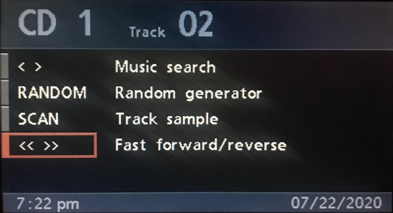
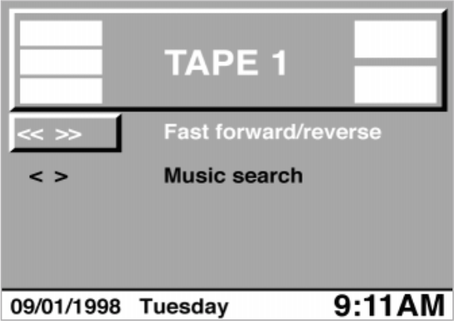
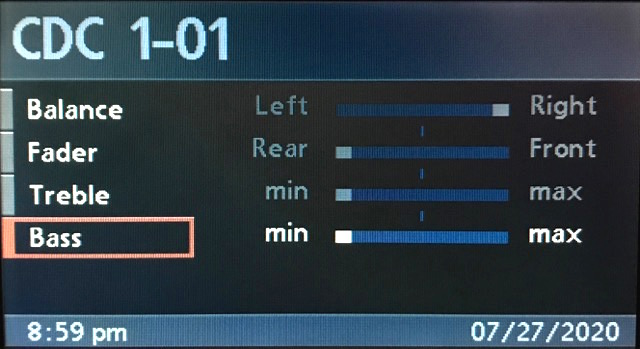
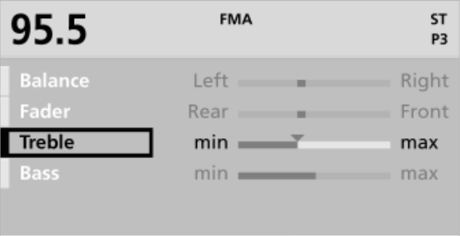

# `0x37` Radio Tone/Select

Radio `0x68` → GT `0x3b`

*BMBT only.*

This command allows the radio to load the appropriate **Tone** (EQ) and **Select** (playback options) menus.

The Tone and Select functionality as introduced with the C23/C24 was almost unusable owing to the counterintuitive UX. Thankfully, the NG radios, and the accompanying UI update (`3-1/40+`) implemented a number of changes to make the functionality somewhat suitable for humans.

<!--- NG radios have different options
- options have new "active" UI state
- NG must specifcy source when loading Select
- NG allows navigating, and selecting rows via dial.-->

### Related Commands

- `0x36`
- `0x46`

### Example Frames

The message length alternates between two fixed lengths. The longer of the two is a [single use case](#).

    68 04 3B 37 05 65
    68 04 3B 37 35 55
    68 04 3B 37 14 74
    68 04 3B 37 50 30
    68 04 3B 37 C0 A0
    68 04 3B 37 E0 80
    
    68 07 3B 37 82 19 15 0E E3
    68 07 3B 37 82 10 10 00 E1
    68 07 3B 37 80 00 00 10 F3

## Parameters

Fixed length. One byte bitfield.
    
    FUNCTION  = 0b1100_0000
    ROW       = 0b0011_0000
    
    # Applies to FUNCTION_SELECT_NG
    SOURCE    = 0b0000_1000
    OPTS      = 0b0000_0111
    
    # Applies to FUNCTION_TONE_SET
    VALUE_BASS      = 0b1_1111 << 3 # FUNCTION_TONE_SET & VALUE_BASS
    VALUE_TREBLE    = 0b1_1111 << 2
    VALUE_FADER     = 0b1_1111 << 1
    VALUE_BALANCE   = 0b1_1111 << 0
    
### Function `0b1100_0000`

A distinction between legacy and NG radios is required with respect to **Select** as the NG radios (and accompanying updated UI) introduced new behaviour.

    FUNCTION_SELECT_NG      = 0b0000_0000
    FUNCTION_SELECT         = 0b0100_0000
    FUNCTION_TONE_SET       = 0b1000_0000
    FUNCTION_TONE           = 0b1100_0000

### Row `0b0011_0000`

Both **Tone** and **Select** menus will have up to four rows.

You'd rightly presume `ROW_A`, would be the first row, `ROW_B` the second, and so on, however, the rows are rendered in... *reverse*.

`ROW_A` is still highlighted by default, the rows are still cycled in order `A, B, C, D`, and if only three rows are needed, `ROW_D` is ommitted, but... yeah, just all upside down.
    
    ROW_A   = 0b0000_0000   # Default. Appears as the "last" row.
    ROW_B   = 0b0001_0000   # Appears at the "second last" row etc.
    ROW_C   = 0b0010_0000
    ROW_D   = 0b0011_0000   # Omitted if only three rows req.

### Source `0b0000_1000`

Only applies to **Select**, and NG radios. (`FUNCTION_SELECT_NG`)

In order to display appropriate source **Select** options, NG radios must specify source. Legacy radios do not specify source as it is implied by the title writes `0x23`.

Note: the tape playback options were deprecated with the updated UI and NG radios.
    
    SOURCE_RADIO            = 0b0000_0000
    SOURCE_CDC              = 0b0000_1000

### Opts `0b0000_0111`

Only applicable to updated UI. Utilised by the NG radios only. (`FUNCTION_SELECT_NG`)
    
    OPTS_HIGHLIGHT          = 0b0000_0100   # Default "hover" state
    OPTS_ACTIVE             = 0b0000_0101
    
### Value `0b0001_1111`

Only applicable to `FUNCTION_TONE_SET`.

Signed magnitude. See [`0x36`](36.md) for reference.

## Use Cases

### Select (BM53)

**TODO:** split bitwise out into code block

#### Radio

Value|Value|Symbol|Text|State
:----|:----|:-----|:---|:----
`FUNCTION_SELECT_NG & ROW_D & SOURCE_RADIO & OPTS_HIGHLIGHT`|`0x34`|`I`| Search non sensitive|Highlight
`FUNCTION_SELECT_NG & ROW_D & SOURCE_RADIO & OPTS_ACTIVE`|`0x35`|`< I >`| Search non sensitive|Activated
`FUNCTION_SELECT_NG & ROW_C & SOURCE_RADIO & OPTS_HIGHLIGHT`|`0x24`|`II`| Search sensitive|Highlight
`FUNCTION_SELECT_NG & ROW_C & SOURCE_RADIO & OPTS_ACTIVE`|`0x25`|`< II >`| Search sensitive|Activated
`FUNCTION_SELECT_NG & ROW_B & SOURCE_RADIO & OPTS_HIGHLIGHT`|`0x14`|`SCAN`| Station sample|Highlight
`FUNCTION_SELECT_NG & ROW_B & SOURCE_RADIO & OPTS_ACTIVE`|`0x15`|`SCAN`| Station sample|Activated
`FUNCTION_SELECT_NG & ROW_A & SOURCE_RADIO & OPTS_HIGHLIGHT`|`0x04`|`m`| Manual station choice|Highlight 
`FUNCTION_SELECT_NG & ROW_A & SOURCE_RADIO & OPTS_ACTIVE`|`0x05`|`< m >`| Manual station choice|Activated

#### CDC

Value|Value|Symbol|Text|State
:----|:----|:-----|:---|:----
`FUNCTION_SELECT_NG & ROW_D & SOURCE_CDC & OPTS_HIGHLIGHT`|`0x3c`|`< >`| Music search|Highlight
`FUNCTION_SELECT_NG & ROW_D & SOURCE_CDC & OPTS_ACTIVE `|`0x3d`|`< >`| Music search|Activated
`FUNCTION_SELECT_NG & ROW_C & SOURCE_CDC & OPTS_HIGHLIGHT`|`0x2c`|`RANDOM`| Random generator|Highlight
`FUNCTION_SELECT_NG & ROW_C & SOURCE_CDC & OPTS_ACTIVE `|`0x2d`|`RANDOM`| Random generator|Activated
`FUNCTION_SELECT_NG & ROW_B & SOURCE_CDC & OPTS_HIGHLIGHT`|`0x1c`|`SCAN`| Track sample|Highlight
`FUNCTION_SELECT_NG & ROW_B & SOURCE_CDC & OPTS_ACTIVE `|`0x1d`|`SCAN`| Track sample|Activated
`FUNCTION_SELECT_NG & ROW_A & SOURCE_CDC & OPTS_HIGHLIGHT`|`0x0c`|`<< >>`| Fast forward/reverse|Highlight
`FUNCTION_SELECT_NG & ROW_A & SOURCE_CDC & OPTS_ACTIVE `|`0x0d`|`<< >>`| Fast forward/reverse|Activated

### Select (C23)

**TODO:** get rid of binary values

Source is inherent for the C23, so the examples below just reflect the three possible contexts: radio, CDC, and tape.

Legacy radios do not support cycling through, or selecting options via the navigation dial. Cycling options requires repeated use of the BMBT's *SELECT* button. As for "activating" a highlighted option, I've not the faintest idea, just mash the BMBT buttons and see how you go.

Note: the below is a C23 BM with MK4 (`4-1/00`) which is an unlikely pairing, but I couldn't be bothered busting out an early "MK1" video module.

#### Radio

Row four/D is omitted as there are only three options.

Value |Value |Value |Symbol|Text
:-----|:-----|:-----|:-----|:---
`FUNCTION_SELECT & ROW_C`|`0b0100_0000 & 0b0010_0000`|`0x60`|`a`   |`Automatic search`
`FUNCTION_SELECT & ROW_B`|`0b0100_0000 & 0b0001_0000`|`0x50`|`SCAN`|`Station sample`
`FUNCTION_SELECT & ROW_A`|`0b0100_0000 & 0b0000_0000`|`0x40`|`m`   |`Manual station choice`

#### CDC

Value |Value |Value |Symbol|Text
:-----|:-----|:-----|:-----|:---
`FUNCTION_SELECT & ROW_D`|`0b0100_0000 & 0b0011_0000`|`0x70`|`< >`|`Music Search`
`FUNCTION_SELECT & ROW_C`|`0b0100_0000 & 0b0010_0000`|`0x60`|`RANDOM`|`Random generator`
`FUNCTION_SELECT & ROW_B`|`0b0100_0000 & 0b0001_0000`|`0x50`|`SCAN`|`Track sample`
`FUNCTION_SELECT & ROW_A`|`0b0100_0000 & 0b0000_0000`|`0x40`|`<< >>`|`Fast forward/reverse`

#### Tape

Rows three (`ROW_C`) and four (`ROW_D`) are omitted as there are only two options.

Value |Value |Value |Symbol|Text
:-----|:-----|:-----|:-----|:---
`FUNCTION_SELECT & ROW_B`|`0b0100_0000 & 0b0001_0000`|`0x50`|`<< >>`|`Fast forward/reverse`
`FUNCTION_SELECT & ROW_A`|`0b0100_0000 & 0b0000_0000`|`0x40`|`< >`|`Music Search`

### Tone (Set)

This is the single use case that affects the message length.

The radio specifies the value of each Tone property when requesting the Tone display.

    FUNCTION_TONE_SET 0x80

    
    # FUNCTION_TONE_SET & 0x10 => 0x90
    68 07 3B 37 90 10 10 00 F3

    
    # Bass    MIN
    # Treble  MIN
    # Fader   MIN
    # Balance MAX
    
    # FUNCTION_TONE_SET & 0x1c => 0x9c
    68 07 3B 37 9C 1C 1F 1F E3

    # FUNCTION_TONE_SET & 0x0c => 0x8c
    68 07 3B 37 8C 0C 0F 0F E3

### Tone

**TODO: technically the wrong image. Should not have hover state**

Value |Value |Value |Text   |State
:-----|:-----|:-----|:------|:---
`FUNCTION_TONE & ROW_D`|`0b1111_0000 & 0b0011_0000`|`0xf0`|Balance|Highlight
`FUNCTION_TONE & ROW_C`|`0b1110_0000 & 0b0010_0000`|`0xe0`|Fader  |Highlight
`FUNCTION_TONE & ROW_B`|`0b1101_0000 & 0b0001_0000`|`0xd0`|Treble |Highlight
`FUNCTION_TONE & ROW_A`|`0b1100_0000 & 0b0000_0000`|`0xc0`|Bass   |Highlight