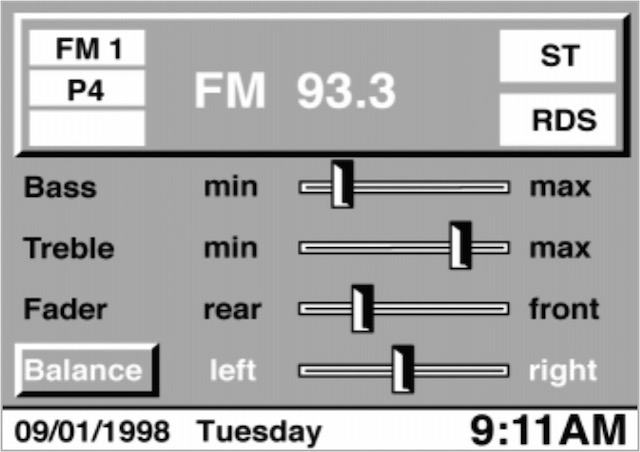
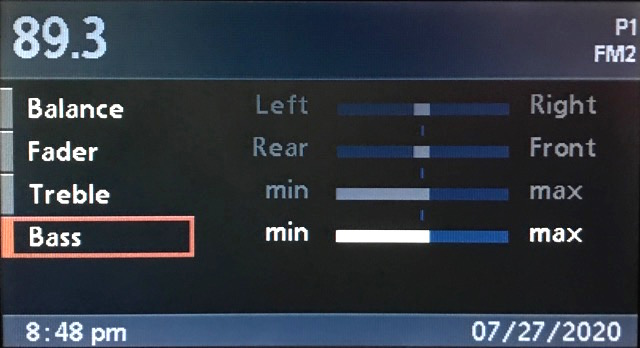

# `0x46` Request Radio UI

Radio `0x68` → GT `0x3b`

The radio has limited control of the display in order to manage it's own interface.

However, the radio is ultimately subserveant to the GT and it's UI state will always be overridden by `0x45`.

### Related

- `0x45` [Set Radio UI](../gt/45.md)

### Examples

    68 04 3B 46 01 10
    68 04 3B 46 02 13
    68 04 3B 46 04 15
    68 04 3B 46 08 19
    68 04 3B 46 0C 1D
    68 04 3B 46 0E 1F

## Parameters

Fixed length. One byte bitfield.

    PRIORITY      = 0b0000_0001
    HIDE_HEADER   = 0b0000_0010
    HIDE_BODY     = 0b0000_1100

### Priority `0b0000_0001`
    
    PRIORITY_RAD  = 0
    PRIORITY_GT   = 1

When set to `1`, the radio is relinquishing the display.

When set to `0`, the radio is managing it's own display functions (outlined in Use Cases).

Note: the radio won't ever set `0` of it's own accord. When the radio is turned on, it will just assume control of the display and begin writing to it, at which point the GT is inherently aware of the radio being in the foreground.

### Hide Header `0b0000_0010`

    HIDE_HEADER         = 0b0000_0010

### Hide Body `0b0000_1100`

    HIDE_BODY_SELECT    = 0b0000_0100
    HIDE_BODY_TONE      = 0b0000_1000
    HIDE_BODY_MENU      = 0b0000_1100

## Use Cases

### Hide Tone

#### C23 BM

> **TBC!**

#### BM53

> - when bringing up TONE
> - when radio hides.. it uses HIDE MENU 0b0000_1100 NOT 0b0000_1000
> - The radio doesn't have to redraw the menu, it's cached in the GT.

### Hide Select

#### C23 BM

> **TBC!**

#### BM53

> - it's the same for soft SELECT
> - HOWEVER, 0b0000_1000 still works if i generate a menu, then 46 08
> - The radio doesn't have to redraw the menu, it's cached in the GT.

### Main Menu

A MENU press does not get sent to radio, but is broadcast, and instead handled by the GT `0x3b`, which will in turn, message the radio `0x68`, requesting it relegate itself to the background.

If the radio is on, but in the background, it will still write to the display for certain events (e.g. changing radio station, CD track etc), but will automatically return to the background after an ~8 second timeout.

GT will only send `0x45` if radio is on.

#### C23 BM
    
    F0 04 FF 48 34 77   # MENU button: press
    3B 04 68 45 01 13   # GT (legacy) requesting radio relinquish display
    68 04 3B 46 01 10   # Radio relinquishing display
    
    # Note the additional 0x45 bit set if Audio OBC enabled:
    F0 04 FF 48 34 77
    3B 04 68 45 03 11
    68 04 3B 46 01 10

#### BM53

Similar to the C23 BM, however with one quirk- the BM53 sends `0x46` twice. (I suspect this is something to do with the updated UI.)

    F0 04 FF 48 34 77   # MENU button press
    3B 04 68 45 91 83   # GT (4-1/00) requesting radio relinquish foreground
    68 04 3B 46 01 10   # Radio relinquishing foreground
    68 04 3B 46 01 10   # Note: BM53 sends this command TWICE

### Hide Overlay

When pressing the OVERLAY button, the radio relinquishes the display. The radio will still write titles, but automatically hide overlay again after ~8 seconds

Unlike a MENU button press, the OVERLAY button press is sent directly to the radio.

#### BM C23
    
    F0 04 68 48 30 E4   # BMBT Overlay button press
    68 04 3B 46 0E 1F   # Radio exits overlay mode

The radio will still write titles, but relinquish the display again after the timeout:

    # Radio writes to display: "FM ☐101.1☐   "
    68 12 3B 23 40 20 46 4D 20 03 31 30 31 2E 31 04 20 20 20 21
    
    # 8 seconds pass...
    
    # Radio automatically hides overlay
    68 04 3B 46 0E 1F

#### BM53

Similar to C23 BM, but `0x46` is sent twice.

    # BMBT Overlay button press
    F0 04 68 48 30 E4

    # Radio hides overlay
    68 04 3B 46 02 13
    68 04 3B 46 0C 1D
    
The BM53 will still write titles, but relinquish the display after a timeout.

    # "☐ 89.3☐      "
    68 .. 3b 23 62 10 "☐ 89.3☐      " ..
    
    # 8 seconds pass...
    
    # Radio hides overlay
    68 04 3B 46 02 13
    68 04 3B 46 0C 1D

### Radio Off

> **TBC!**

#### C23 BM

    ...

#### BM53
    
    f0 .. 68 48 06 ..  # Power button: press
    68 .. f0 4a 00 ..  # BMBT radio led: off
    68 .. 3b 46 0e ..  # Radio hide overlay
    f0 .. 68 4b 05 ..  # Tape: none