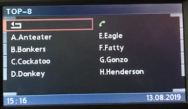
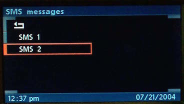

# `0x21` Menu Text: Telephone

Telephone `0xc8` → GT `0x3b`  
Telephone `0xc8` → MID `0xc0`

*Only BMBT (GT) usage is discussed!*

### Related

- `0x21` Menu Text: Radio
- `0x21` Menu Text: Cluster
- `0x23` [Title Text: Telephone](23.md)
- `0x24` [Property Text: Telephone](24.md)
- `0x31` Menu Button: Telephone

### Example Frames
    
    # Telephone: CMT4000
    C8 06 3B 21 42 02 20 B4
    C8 1E 3B 21 43 01 60 06 43 61 6C 6C 43 6F 6E 6E 65 63 74 06 4D 65 73 73 61 67 65 42 61 6E 6B FF
    C8 18 3B 21 43 01 04 06 4D 55 4D 06 59 65 6C 6C 6F 77 50 61 67 65 73 44 69 90
    C8 16 3B 21 80 01 60 06 43 61 6C 6C 43 6F 6E 6E 65 63 74 06 4D 55 4D 0C
    C8 20 3B 21 80 01 04 06 4D 65 73 73 61 67 65 42 61 6E 6B 06 59 65 6C 6C 6F 77 50 61 67 65 73 44 69 53

<!--
    # MID (Telephone: ULF)
    C8 19 C0 21 40 00 60 06 20 20 44 49 41 4C 20 20 06 20 20 44 49 52 2E 20 20 00 61
    C8 19 C0 21 40 00 44 06 4E 4F 54 45 20 50 41 44 06 20 20 53 4F 53 20 20 20 00 3E
    C8 18 C0 21 40 00 08 06 20 20 20 20 20 20 20 20 06 AE AE 20 20 20 20 AD 00 D4
-->

## Parameters

Length will vary with *String*.

Property|Index|Length|Type
:-------|:----|:-----|:---
Layout|`0`|`1`|Bitfield
Function|`1`|`1`|Bitfield
Options|`2`|`1`|Bitfield
String|`3`|`-1`|String

---

### Layout
    
    DIAL      = 0x42
    DIRECTORY = 0x43
    TOP_8     = 0x80
    LIST      = 0xf0    # SMS: Index, "Bluetooth Pairing"
    DETAIL    = 0xf1    # SMS: Message, SOS/Emergency

`0xf0` and `0xf1` were introduced later in production, and had multiple use cases.

---

### Function
    
    NULL            = 0x00
    CONTACT         = 0x01
    DIGIT           = 0x02
    SOS             = 0x05
    NAVIGATION      = 0x07
    INFO            = 0x08

Presumably to help differentiate the the function of a given layout and index returned by `0x31`.

---

### Options

    INDEX       = 0b0001_1111   # Index of field to write to
    CLEAR       = 0b0010_0000   # Clear layout
    BUFFER      = 0b0100_0000   # Buffer the write
    HIGHLIGHT   = 0b1000_0000   # Highlight given field

#### Index `0b0001_1111`

Each layout has a given number of fields, each of which is represented by a known index.

This might also be thought of as a cursor position from which to start writing. The control character `0x06` will move the cursor to the next index.

#### Clear `0b0010_0000`

Setting this bit will clear the given layout, including the buffer. As such, it's only set on the *first* message.

Careful omission of this bit allows the updating the rendered display. However, the factory implementation seemingly always writes the display in it's entirity, thus always clearing the display when commencing writing.

#### Buffer `0b0100_0000`

As populating a display requires multiple messages, the GT `0x3b` will buffer preliminary messages until the entire display is ready to be rendered.

All but the last message will have this bit set. The absense of the bit in the final messages is what triggers the GT `0x3b` to render the buffer.

#### Highlight `0b1000_0000`

The field with the given index will be highlighted.

I've not seen this used in the factory implementation. If omitted, the first, or last selected field (for the given layout) will be highlighted.

---

### String

Code Point|Name|Description
:--|:--|:--
`0x00`|NUL|Null-terminated string
`0x06`|LF|Line Feed
    
## Use Cases

Given that several commands are associated with each use case, they're discussed in their own respective documentation.

### Dial

[Telephone: Dial](dial.md)

### Directory

[Telephone: Directory](directory.md)

### Top 8

[Telephone: Top 8](top_8.md)

### SMS: Index

[Telephone: SMS Index](list.md)

### Bluetooth Pairing

[Telephone: SMS Index](list.md)

### SMS: Message

[Telephone: SMS Message](detail.md)

### SOS/Emergency

[Telephone: Emergency](detail.md)

