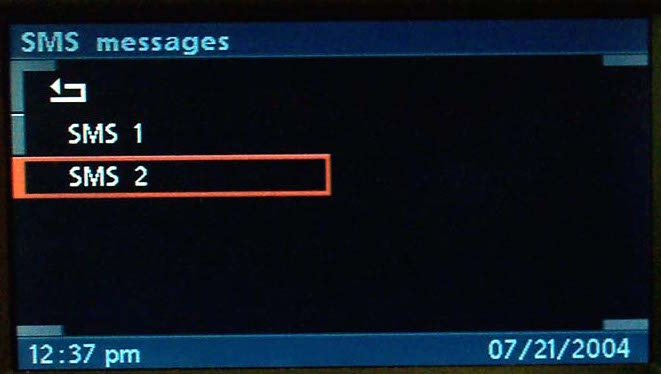
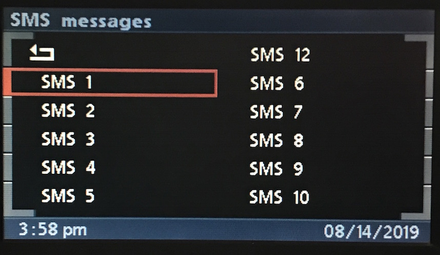
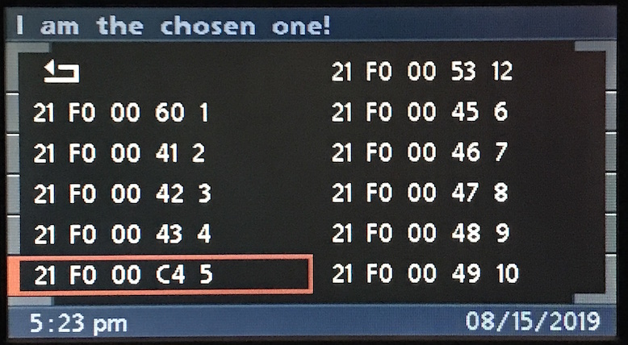
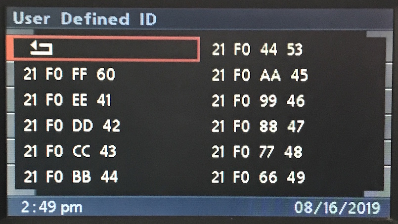
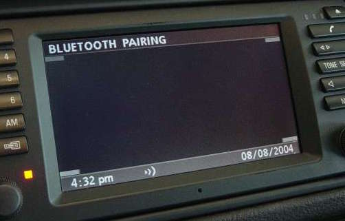
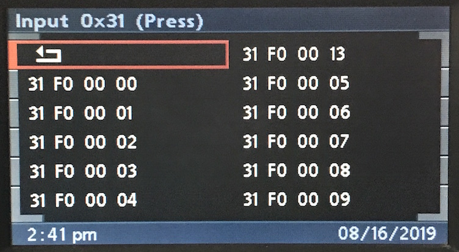
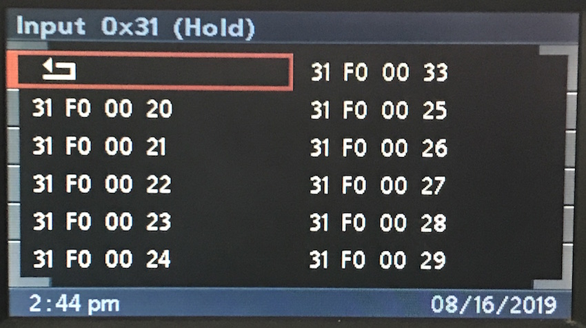

# SMS Index

## Create

This is very similar to using radio layouts.

    # Items
    C8 <LEN> 3B 21 F0 00 60 <CHARS> <CS>
    C8 <LEN> 3B 21 F0 00 41 <CHARS> <CS>
    C8 <LEN> 3B 21 F0 00 42 <CHARS> <CS>
    C8 <LEN> 3B 21 F0 00 43 <CHARS> <CS>
    C8 <LEN> 3B 21 F0 00 44 <CHARS> <CS>
    C8 <LEN> 3B 21 F0 00 45 <CHARS> <CS>
    C8 <LEN> 3B 21 F0 00 46 <CHARS> <CS>
    C8 <LEN> 3B 21 F0 00 47 <CHARS> <CS>
    C8 <LEN> 3B 21 F0 00 48 <CHARS> <CS>
    C8 <LEN> 3B 21 F0 00 49 <CHARS> <CS>
    C8 <LEN> 3B 21 F0 00 53 <CHARS> <CS> # Lonely item in top right

    # Back Button
    C8 <LEN> 3B 21 F0 00 50 <CHARS> <CS>

    # Title and render layout
    C8 <LEN> 3B A5 F0 01 00 <CHARS> <CS>

### Default Selected Item

    # Highlight 5th Item
    # Add 0b1000_0000 (0x80) to last argument (0x44)
    # 0x44 | 0x80 = 0xC4

    C8 <LEN> 3B 21 F0 00 C4 <CHARS> <CS> # I am chosen!

### User Defined Item ID

The value returned by `0x31` can be specified.

    # User Defined IDs denoted by: [XX]

    # Items
    C8 <LEN> 3B 21 F0 [FF] 60 "21 F0 FF 60" <CS>
    C8 <LEN> 3B 21 F0 [EE] 41 "21 F0 EE 41" <CS>
    C8 <LEN> 3B 21 F0 [DD] 42 "21 F0 DD 42" <CS>
    C8 <LEN> 3B 21 F0 [CC] 43 "21 F0 CC 43" <CS>
    C8 <LEN> 3B 21 F0 [BB] 44 "21 F0 BB 44" <CS>
    C8 <LEN> 3B 21 F0 [AA] 45 "21 F0 AA 45" <CS>
    C8 <LEN> 3B 21 F0 [99] 46 "21 F0 99 46" <CS>
    C8 <LEN> 3B 21 F0 [88] 47 "21 F0 88 47" <CS>
    C8 <LEN> 3B 21 F0 [77] 48 "21 F0 77 48" <CS>
    C8 <LEN> 3B 21 F0 [66] 49 "21 F0 66 49" <CS>
    C8 <LEN> 3B 21 F0 [44] 53 "21 F0 44 53" <CS> # Out of order field

    # Back button accepts ID!
    C8 <LEN> 3B 21 F0 [55] 50 "21 F0 55 50" <CS>

    # Title and render layout
    C8 <LEN> 3B A5 F0 00 00 "User Defined ID" <CS>

**User Defined IDs Returned by `0x31`**

#### _Warning!_
_Once the button ID is set, it cannot be changed!_ It's not until GT renders Main Menu, that this value can be changed. Updating the button label, or removing the button altogether before attempting to change the value had no effect.

### Title Only

Lines and Inputs can be omitted, and just the title set, ala "BLUETOOTH PAIRING".

    # Title Only
    C8 <LEN> 3B A5 F0 00 00 "BLUETOOTH PAIRING" <CS>

### Title Padding

    # Tittle Padding
    # 5 LSBs in first argument can be used to pad text

    C8 <LEN> 3B A5 01 00 <CHARS> <CS> # No padding
    C8 <LEN> 3B A5 02 00 <CHARS> <CS> # Pad 1
    C8 <LEN> 3B A5 03 00 <CHARS> <CS> # Pad 2
    C8 <LEN> 3B A5 04 00 <CHARS> <CS> # Pad 3
    C8 <LEN> 3B A5 05 00 <CHARS> <CS> # Pad 4
    C8 <LEN> 3B A5 06 00 <CHARS> <CS> # Pad 5

## Inputs

    # Press
    3B <LEN> C8 31 F0 00 00 <CS>
    3B <LEN> C8 31 F0 00 01 <CS>
    3B <LEN> C8 31 F0 00 02 <CS>
    3B <LEN> C8 31 F0 00 03 <CS>
    3B <LEN> C8 31 F0 00 04 <CS>
    3B <LEN> C8 31 F0 00 05 <CS>
    3B <LEN> C8 31 F0 00 06 <CS>
    3B <LEN> C8 31 F0 00 07 <CS>
    3B <LEN> C8 31 F0 00 08 <CS>
    3B <LEN> C8 31 F0 00 09 <CS>

    3B <LEN> C8 31 F0 00 10 <CS> # Back Button
    3B <LEN> C8 31 F0 00 13 <CS> # Top Right

    # Add 0x20 to last byte

    # Add 0x40 to last byte

## Update

### Selected Item

**TODO**
