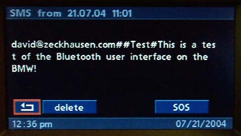
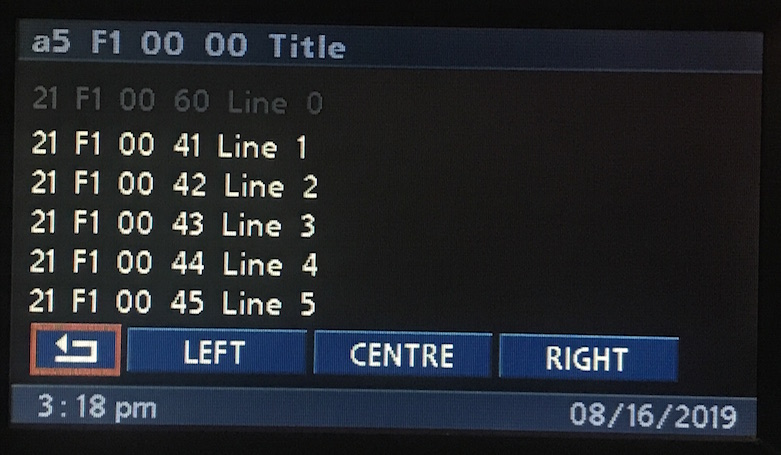
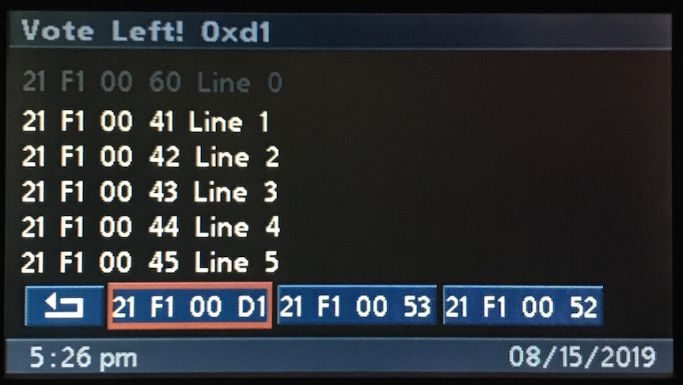
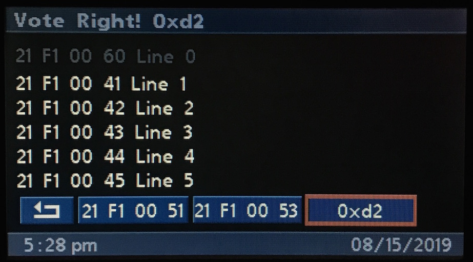
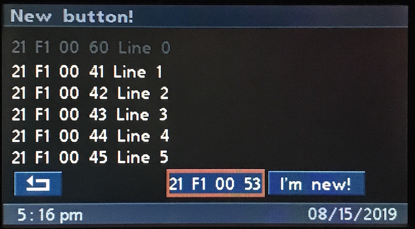
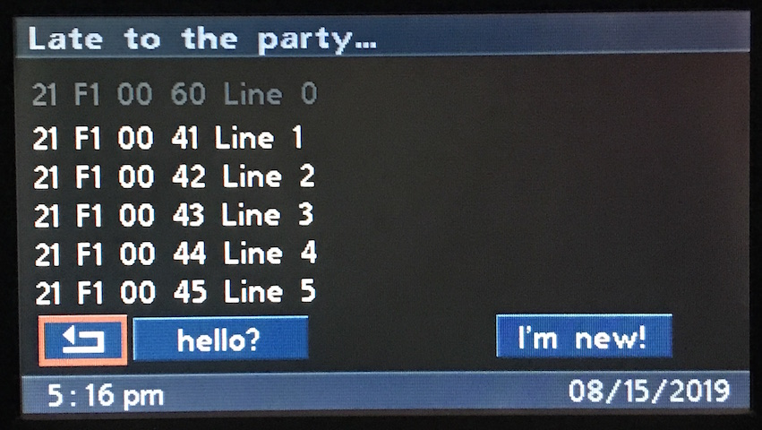

# Telephone: SMS Message & Emergency

## Create

This is, near as makes no difference, the same as creating radio layouts with a few minor differences.

    # Lines
    C8 <LEN> 3B 21 F1 00 60 "Line 0" <CS> # Always grey!
    C8 <LEN> 3B 21 F1 00 41 "Line 1" <CS>
    C8 <LEN> 3B 21 F1 00 42 "Line 2" <CS>
    C8 <LEN> 3B 21 F1 00 43 "Line 3" <CS>
    C8 <LEN> 3B 21 F1 00 44 "Line 4" <CS>
    C8 <LEN> 3B 21 F1 00 45 "Line 5" <CS>    

    # Back
    # I use 0x01 just as to more easily identify Back
    # Factory may use something else all together.
    C8 <LEN> 3B 21 F1 <ID> 50 01 <CS>

    # Buttons
    C8 <LEN> 3B 21 F1 <ID> 51 "LEFT" <CS>
    C8 <LEN> 3B 21 F1 <ID> 52 "RIGHT" <CS>
    C8 <LEN> 3B 21 F1 <ID> 53 "CENTRE" <CS>

    # 0x23 won't render like with some Radio layouts
    # 0xA5 will both set the title and render layout
    C8 <LEN> 3B A5 F1 00 00 "a5 F1 00 00 Title" <CS>

### Buttons
- the buttons will only be displayed if their label is set
- this includes the "Back" button, which can also be omitted

    # Display only "Back" and middle buttons
    # Lines...
    C8 <LEN> 3B 21 F1 00 50 01 <CS>
    C8 <LEN> 3B 21 F1 00 53 "21 F1 00 53" <CS>
    # Render...

### User Defined Button ID

It's possible to set the value returned by `0x31` when an item is selected.

This might be important in the event that telematics are still active in the vehicle! As the Emergency function (seemingly) uses the same layout, it's worth double checking how the telephone distinguishes between SMS and Emergency.

    # Set Left button ID to 0x77
    C8 <LEN> 3B 21 F1 77 51 "LEFT" <CS>

    # ID 0x77 returned by 0x31 when button selected!
    3B <LEN> C8 31 F1 77 11 <CS> # Press

#### WARNING!
**I've since noticed that once the button ID is set, _it cannot be changed_! I've tried updating the button label, hiding then showing it again, etc etc, but it's only after GT renders Main menu that the ID can be changed. This caught me out as I was using ID to keep everything stateless.**

#### _Warning!_
_Once the button ID is set, it cannot be changed!_ It's not until GT renders Main Menu, that this value can be changed. Updating the button label, or removing the button altogether before attempting to change the value had no effect.

### Default Selected Button

Set the highlighted button:

    # Select LEFT button by default

    # Add 0b1000_0000 (0x80) to third argument (0x51)
    # Bitwise OR
    # 0b1000_0000 (0x80)
    # 0b0101_0001 (0x51)
    # -----------
    # 0b1101_0001 (0xd1)
    # ===========

    C8 <LEN> 3B 21 F1 00 D1 "0xd1" <CS>
    C8 <LEN> 3B A5 F1 00 00 "Vote Left! 0xd1" <CS>

    # Select RIGHT button by default
    # 0b1000_000|0x52 => 0xd2

    C8 <LEN> 3B 21 F1 00 D2 "0xd2" <CS>
    C8 <LEN> 3B A5 F1 00 00 "Vote Right! 0xd2" <CS>

### Line Breaks

These must be used with care. The GT definitely has a fixed buffer size, and exceeding it causes all kinds of mayhem!

    # Line Break
    C8 <LEN> 3B 21 F1 00 60 "Line 0" <CS>
    C8 <LEN> 3B 21 F1 00 41 "Not quite auto wrap but" 06
                            "in the circumstances, we'll take it!" <CS>

    C8 <LEN> 3B A5 F1 00 00 "Line Break" <CS>

## Inputs

	# Back
	SMS Show > <ID> > Back            3B 06 C8 31 f1 <ID> 10 <CS>

	# Buttons
	SMS Show > <ID> > Left            3B 06 C8 31 f1 <ID> 11 <CS>
	SMS Show > <ID> > Right           3B 06 C8 31 f1 <ID> 12 <CS>
	SMS Show > <ID> > Middle          3B 06 C8 31 f1 <ID> 13 <CS>

## Updates

It's possible to update effectively any subset of fields, thus mitigating the need to write the entire display again.

Ensure the "flush" bit isn't set on any commands, which will otherwise clear the entire display.

### Add Button

    # Add a button
    C8 <LEN> 3B 21 F1 00 52 "I'm new" <CS>
    C8 <LEN> 3B A5 F1 00 00 "New button!" <CS>

    # To select the new button add 0b1000_0000
    C8 <LEN> 3B 21 F1 00 D2 "I'm new" <CS>
    C8 <LEN> 3B A5 F1 00 00 "New button!" <CS>

### Remove Button

    # Remove a button
    # Use null-terminated string
    # https://en.wikipedia.org/wiki/Null-terminated_string

    C8 <LEN> 3B 21 F1 00 50 00 <CS>       # remove centre button
    C8 <LEN> 3B 21 F1 00 51 "hello?" <CS> # add left button
    C8 <LEN> 3B A5 F1 00 00 "Late to the party..." <CS>
