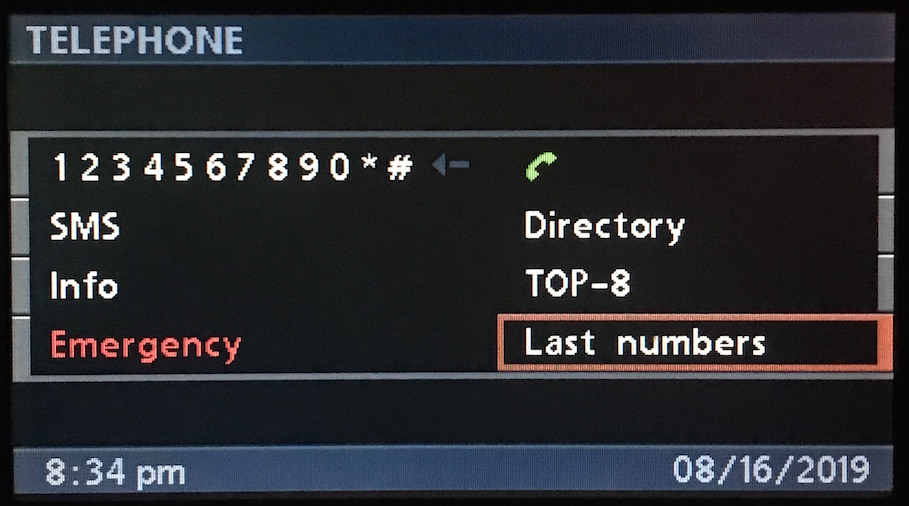
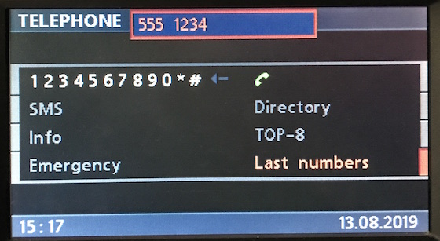

# Telephone: Last Numbers

Squeezed into **Dial** is **Last Numbers**.

## Inputs

    # Open "Last Numbers"
    3B 06 C8 31 00 00 0D C8

As this command is also used for "next" last number, a number is rendered upon open.

    # Close "Last Numbers"
    # No input received!
    
Last Numbers is closed by confirming with the rotary knob. A `0x31` command isn't sent to the telephone, meaning the last written number remains on the display unless otherwise cleared. This may be normal behaviour, but TBC.

Navigating the numbers is then done with the rotary knob. Unlike volume controls, there's no "magnitude", and rotating the control at a faster rate simply sends the same command at a higher frequency.

    # Previous Number (Rotary Left Turn)
    3B 06 C8 31 00 00 0C C9
    # C8 <LEN> 3B 23 ... 

    # Next Number (Rotary Right Turn)
    3B 06 C8 31 00 00 0D C8
    # C8 <LEN> 3B 23 ...

### Conflict with Directory Input

**Last Numbers** is a bit of a pain in that the command sent to go back/forward is identical to that sent when "<<" and ">>" are selected in **Directory**.

    # Directory "<<" (Press)
    3B 06 C8 31 00 00 0C C9

    # Directory ">>" (Press)
    3B 06 C8 31 00 00 0D C8

This is similar to **Main Menu** vs. **Top-8**, which also use the same commands. As in that case, by having telephone maintain a state/session, it can differentiate the commands appropriately. This could be based on which layout was drawn last, i.e. **Dial** `0x42`, **Directory** `0x43` etc.

## Update

This is identical to setting/cleaning the dial digits.

    # Set Number
    C8 <LEN> 3B 23 63 20 "555 1234" <CS>

    # Clear Number
    C8 05 3B 23 61 20 94
